### Part 1

* Устанавливаем Ubuntu.

Да, я знаю, что по заданию другая версия, но я захотел установить эту. Еще и графический интерфейс поставил


* Скачиваем, устанавливаем Gitlab Runner

```sudo curl -L --output /usr/local/bin/gitlab-runner "https://gitlab-runner-downloads.s3.amazonaws.com/latest/binaries/gitlab-runner-linux-arm64"```

```sudo chmod +x /usr/local/bin/gitlab-runner```

```sudo useradd --comment 'Gitlab Runner' --create-home gitlab-runner --shell /bin/bash```

```sudo gitlab-runner install --user=gitlab-runner --working-directory=/home/gitlab-runner```

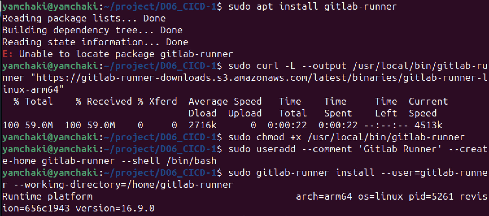

* Регистрируем

```gitlab-runner register```

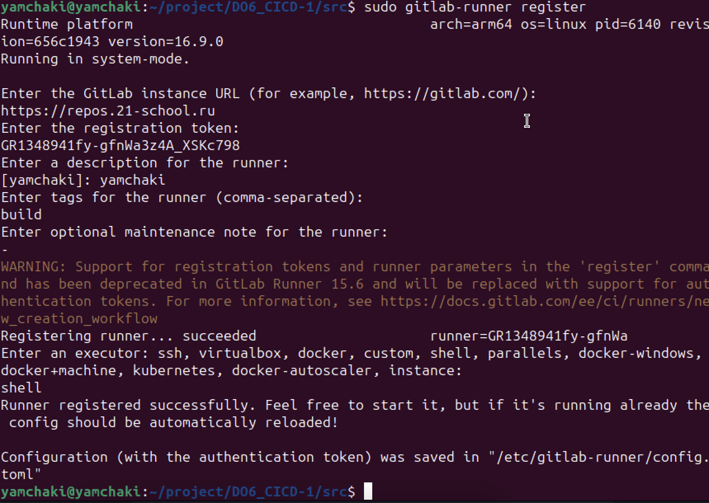

* Проверяем

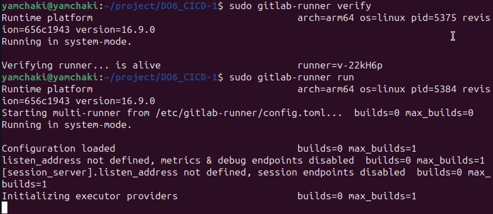

### Part 2

Сборка

* В файле gitlab-ci.yml добавим этап запуска сборки через мейк файл из проекта C2.

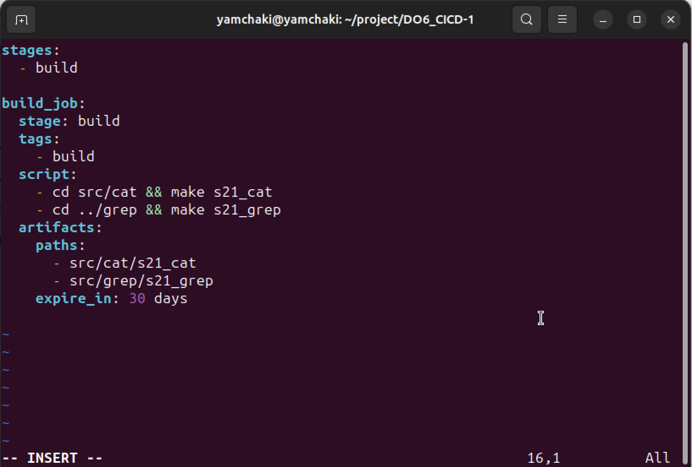

Файлы, полученные после сборки (артефакты), сохраним в произвольную директорию со сроком хранения 30 дней.

* Изначально видим вот такую ошибку после выполнения

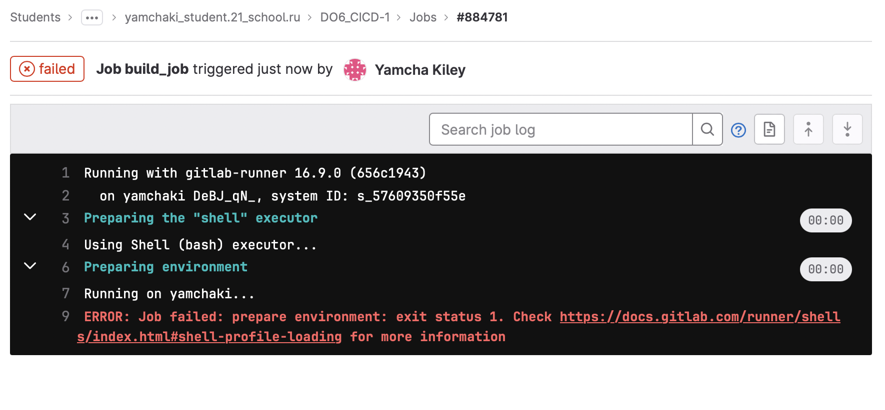

* Побеждаем ее благодаря [статье](https://stackoverflow.com/questions/63154881/the-runner-of-type-shell-dont-work-job-failed-system-failure-preparing-envi)

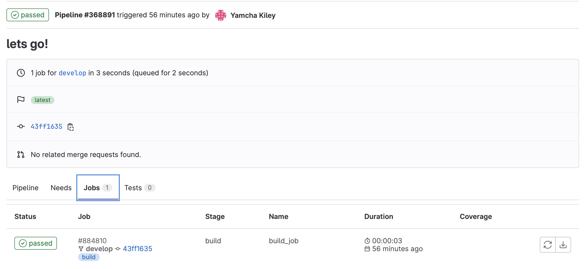

### Part 3

* Напишем этап для CI, который запускает скрипт кодстайла (clang-format).

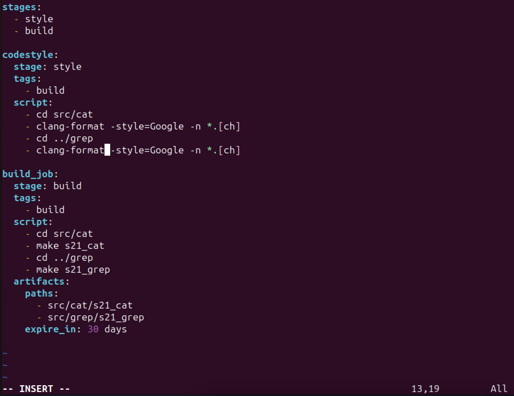


* Если кодстайл не прошел, то «зафейлим» пайплайн.

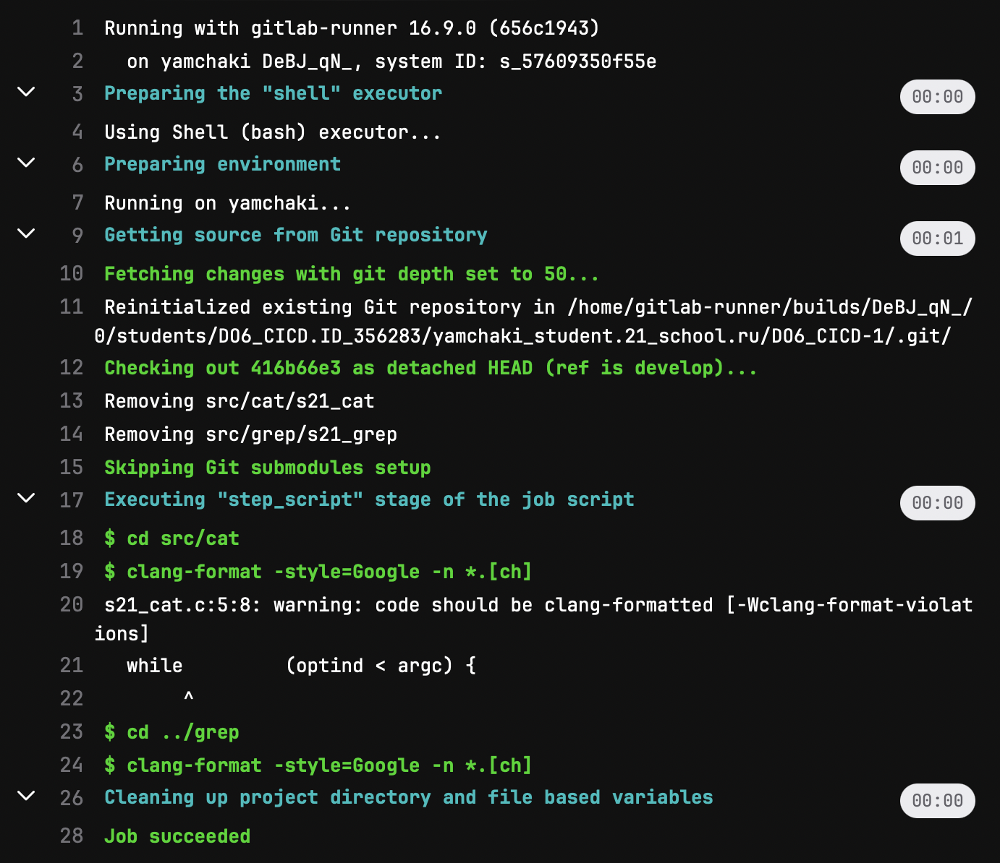

* В пайплайне отобразим вывод утилиты clang-format.

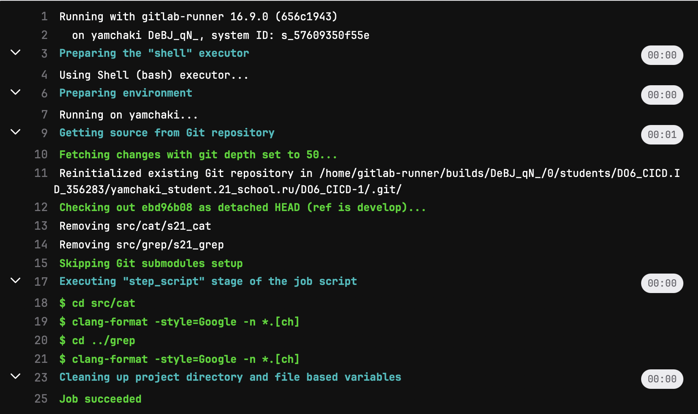

### Part 4

* Напишем этап для CI, который запускает интеграционные тесты из того же проекта.

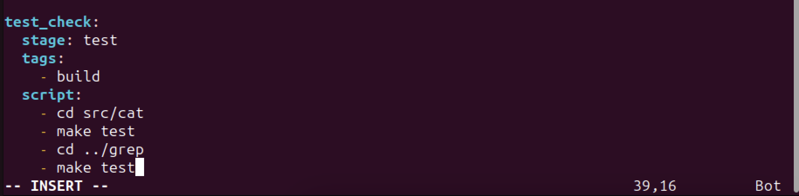

* Запустим этот этап автоматически только при условии, если сборка и тест кодстайла прошли успешно.

* Если тесты не прошли, то «зафейлим» пайплайн.

* В пайплайне отобразим вывод, что интеграционные тесты успешно прошли / провалились.

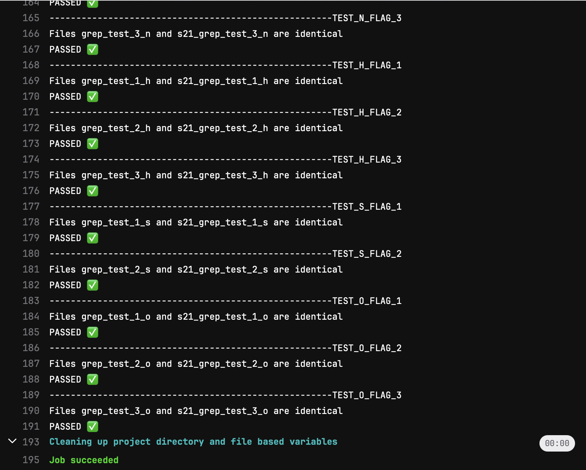

### Part 5

* Поднимем вторую виртуальную машину.

Настраиваем сеть

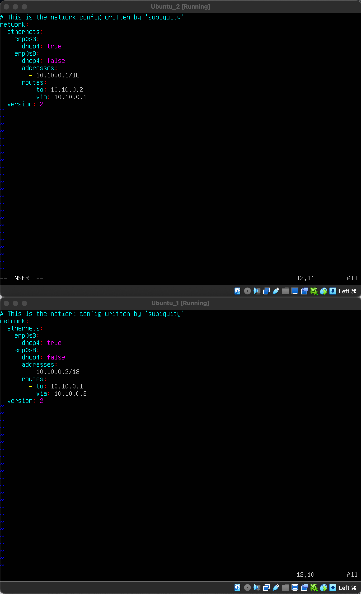

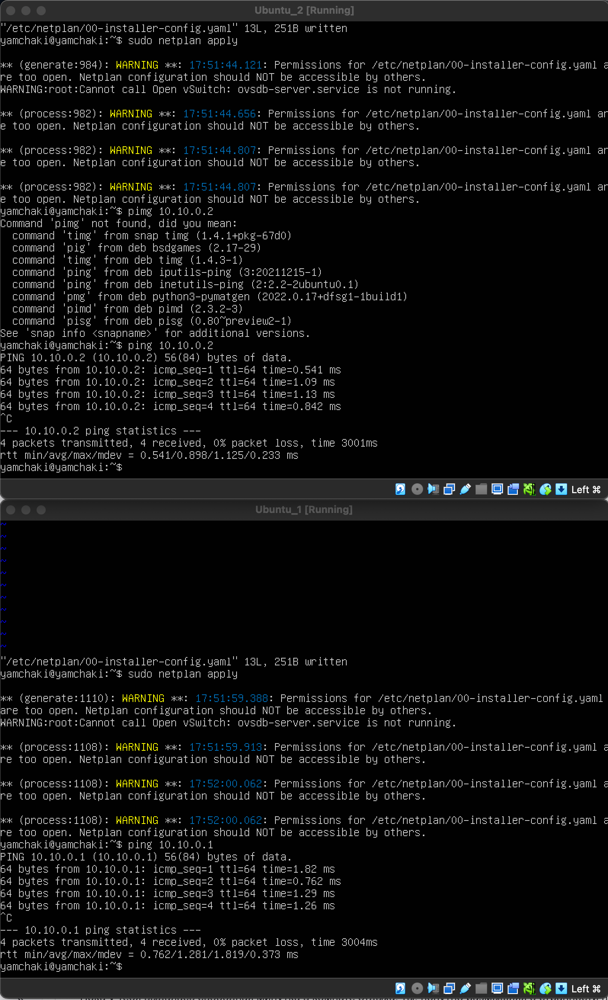

Добавляем на вторую машину ssh-ключ

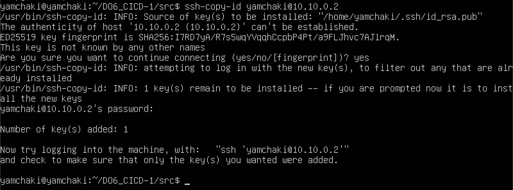

* Напишем этап для CD, который «разворачивает» проект на другой виртуальной машине.

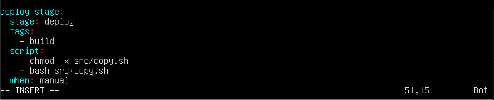

### Part 6

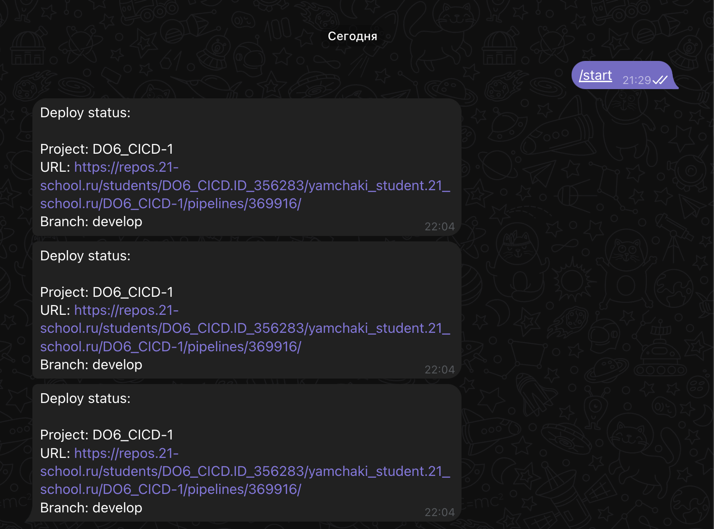
