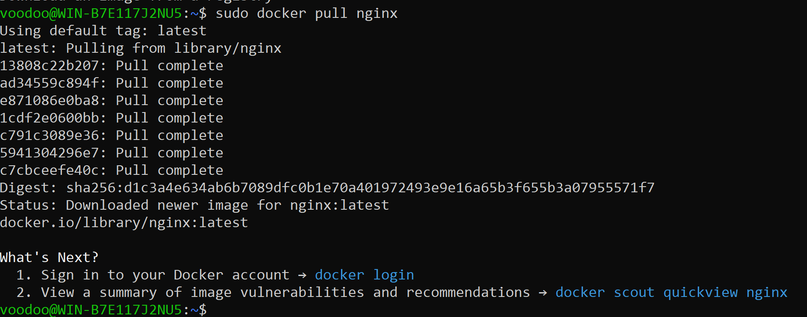
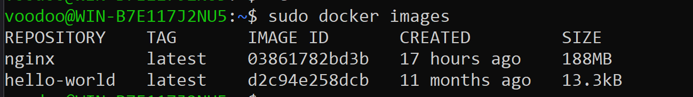
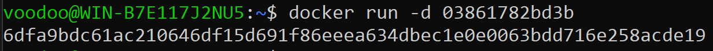
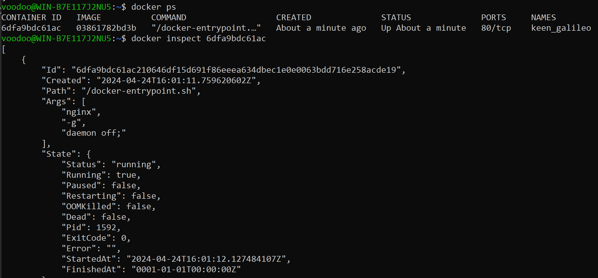
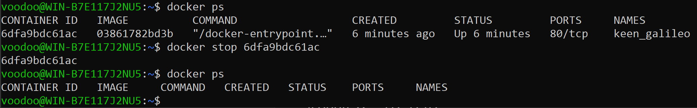
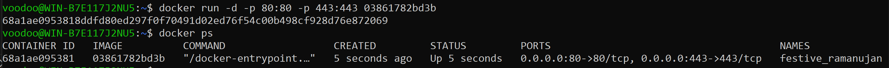
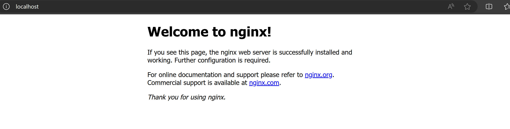
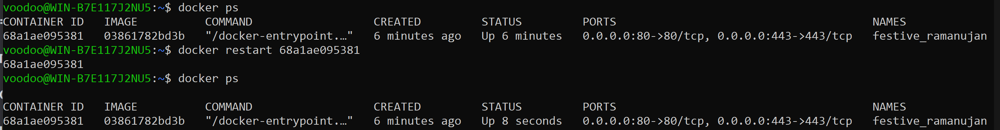

Загрузили образ nginx

Смотрим список образов, чтобы узнать id образа nginx

Запускаем с флагом -d

Смотрим информацию о контейнере

"Size": 187557417 (байт)

"ExposedPorts": {
"80/tcp": {}
}

"IPAddress": "172.17.0.2"

Остановить работу контейнера

Запускаем с портами 80 443

Проверяем localhost:80

Рестартаем

Значение статус == 8 sec, значит, перезапуск сервера произошел.

