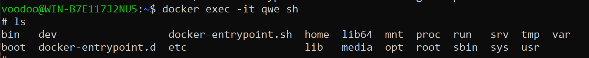

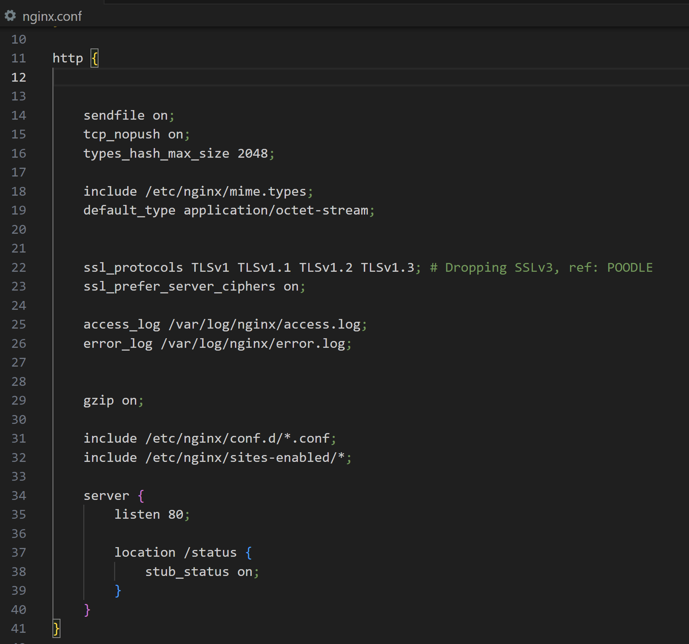

копируем изменный nginx.conf в контейнер

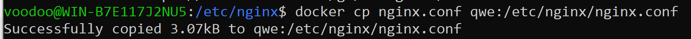
Открываем терминал контейнера и перезапускаем nginx

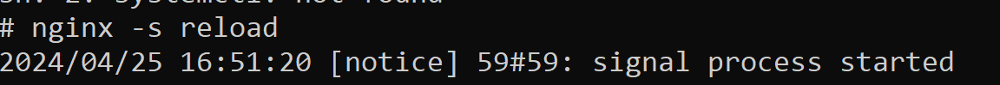

Смотрим  localhost/status

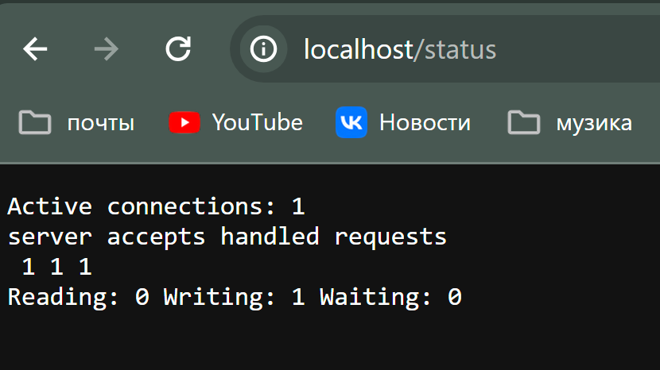

Копирование созданного файла nginx.conf внутрь докер-образа.

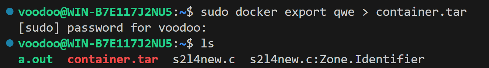

Останавливаем работу контейнера

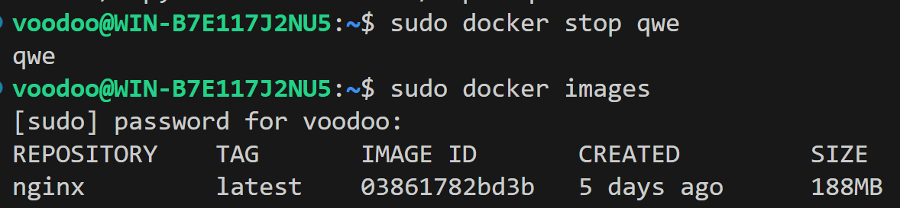

Пытаемся удалить image

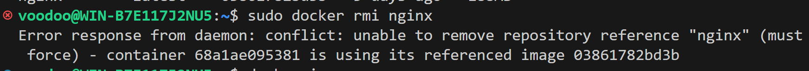

Удаляем контейнер

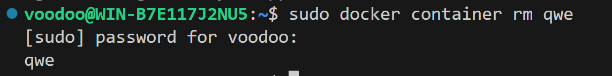
 Импортируем из tar образ

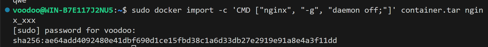

Запускаем контейнер с полученным образом

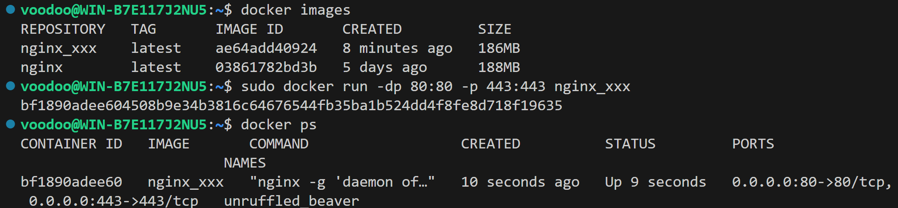

